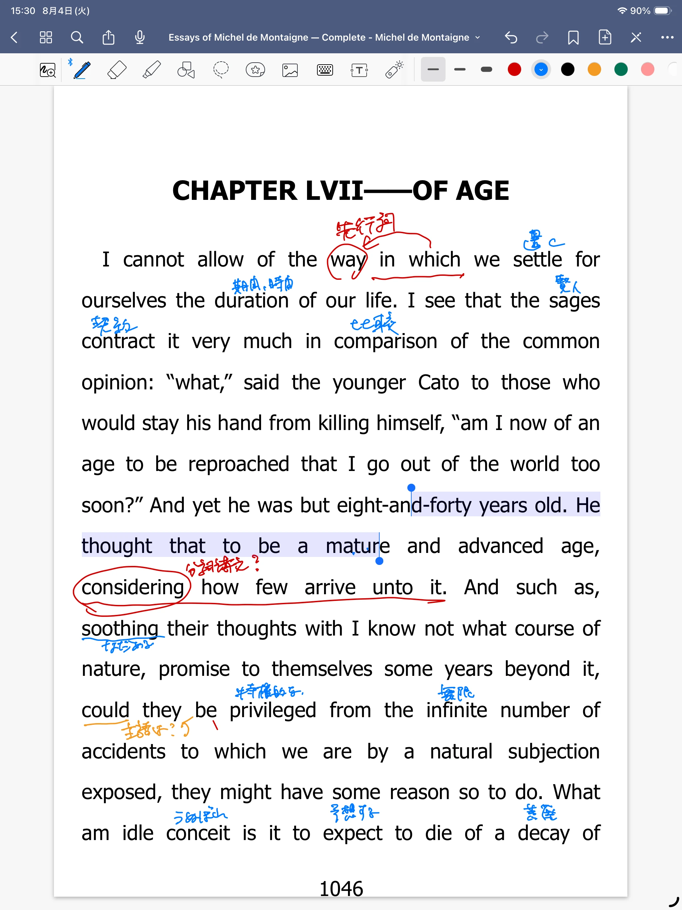

*PDF: pp.1046–1047*
## 原文

> I cannot allow of the way in which we settle for ourselves the duration of our life. I see that the sages contract it very much in comparison of the common opinion: “what,” said the younger Cato to those who would stay his hand from killing himself, “am I now of an age to be reproached that I go out of the world too soon?” And yet he was but eight-and-forty years old. He thought that to be a mature and advanced age, considering how few arrive unto it. And such as, soothing their thoughts with I know not what course of nature, promise to themselves some years beyond it, could they be privileged from the infinite number of accidents to which we are by a natural subjection exposed, they might have some reason so to do. What am idle conceit is it to expect to die of a decay of strength, which is the effect of extremest age, and to propose to ourselves no shorter lease of life than that, considering it is a kind of death of all others the most rare and very seldom seen?

## 読んだときの書き込み画像

## 最初に読んだときの訳

私は許可できない・やり方を・私たちの人生の長さを私たちが置くことを。私はわかっている・賢人たちが一般の意見よりそれをとても……と契約してることを。

若いコトーは言った。

「何と」

彼は自分自身を殺そうとする手を止められた。

「私がこの世を去るのが、今の私が報告されている歳より早すぎるって？」

そして彼はまだ54歳だった。彼は考えた。成熟した進歩した歳だと。それより下は考えられていないと。

そして、私の知らない自然の道と考えられている彼らの考えをなだめながら、彼ら自身にいくつかそれより下だと約束しながら、彼らは無限の数の出来事から特権的であることができる。彼らはそうする理由をもっているかもしれない。

私の怠惰なうぬぼれは死ぬことを予想する。強さの腐敗を。それは極度の効果で、それよりもっと短い期間を提示することで、めったにない種類の死を考えながら。

## ChatGPTによる添削についての注記

以下の「読み直した訳」と「英文を考える」は、ChatGPTによる添削と文法・語法・文構造の解説をもとにまとめた。

## 読み直した訳

私たちが、自分の寿命をどのくらいだと見定める、その考え方には賛成できない。

賢人たちは、一般の人々の考えに比べて、人生をずっと短いものと見積もっているように思われる。

若きカトーは、自殺しようとする手を止めようとした人々に、こう言った。

「何だと。私はもう、この世を去るのが早すぎると非難されるような年齢なのか」

とはいえ、彼はまだ四十八歳にすぎなかった。しかし彼は、そこまで生きる人が少ないことを考えれば、四十八歳は十分に成熟した、かなり進んだ年齢だと考えていた。

一方、よく分からない「自然の成り行き」のようなものを思い浮かべて心を慰め、自分はその年齢よりも何年か長く生きられるだろうと思っている人々もいる。

もし彼らが、人間が生まれながらにさらされている無数の事故や災難から免れることを保証されているのなら、そう考えるのにも多少の理由はあるだろう。

しかし、老齢の極みによって体力が衰え、その結果として死ぬことを当然のように期待し、それより短い寿命を自分に想定しないとは、何と愚かな思い込みだろう。

そのような死は、あらゆる死に方の中でも最もまれで、めったに見られないものだからである。

## 英文を考える

### allow of

> I cannot allow of the way ...

`allow`を「許可する」と考えたが、ここでの`allow of`は古い表現で、「認める」「賛成する」「よしとする」という意味になる。

したがって、

> 私はその考え方には賛成できない

と読む。

### settle the duration of our life

> we settle for ourselves the duration of our life

`settle`は「置く」ではなく、「決める」「定める」「見積もる」という意味。

ここでは、自分が何歳まで生きるかを、自分の中で決めることを表している。

### contract

> the sages contract it very much

`contract`には「契約する」という意味もあるが、ここでは「縮める」「短くする」「小さく見積もる」という意味。

`it`は`the duration of our life`を指している。

> 賢人たちは、人生をずっと短く見積もっている

となる。

### カトーの発言に入っている挿入

> “what,” said the younger Cato to those who would stay his hand from killing himself, “am I now of an age ...?”

発言の途中に、

> said the younger Cato ...

が挿入されている。

挿入部分をいったん外すと、発言の形が見えやすくなる。

> What, am I now of an age to be reproached that I go out of the world too soon?

> 何だと。私はもう、この世を去るのが早すぎると非難されるような年齢なのか。

### stay his hand

> those who would stay his hand from killing himself

`stay`は、ここでは「滞在する」ではなく「止める」。

`stay his hand`で、「彼の手を止める」「彼がしようとしていることをやめさせる」という意味になる。

文全体では、

> 自殺しようとする彼を止めようとした人々

となる。

### eight-and-forty

> he was but eight-and-forty years old

古い数の表し方で、

> eight and forty  
> 8＋40

という順序になっている。

したがって、54歳ではなく48歳。

`but`も、ここでは「しかし」ではなく、「～にすぎない」という意味になる。

### how few arrive unto it

> considering how few arrive unto it

`it`は四十八歳を指している。

`arrive unto it`は、「その年齢に到達する」「そこまで生きる」という意味。

> そこまで生きる人がどれほど少ないかを考えれば

となる。

### I know not what

> with I know not what course of nature

古い表現で、現代英語の`I do not know what`に近い。

ここでは、「よく分からない何らかの」「何というのか分からないような」という意味で使われている。

したがって、

> よく分からない「自然の成り行き」のようなもの

と考える。

### promise to themselves some years beyond it

> promise to themselves some years beyond it

直訳すると、

> その年齢を何年か越えることを自分自身に約束する

となる。

自然な日本語では、

> 自分はその年齢より何年か長く生きられると思う

という意味になる。

ここでも`it`は四十八歳を指している。

### could they be privileged ...

> could they be privileged from the infinite number of accidents ...

これは疑問文ではなく、仮定法の倒置。

通常の語順に戻すと、

> if they could be privileged from the infinite number of accidents ...

となる。

> もし彼らが無数の事故から免れることができるのなら

という意味。

`if`が省略され、`could`が主語の前に出ている。

### be privileged from

`privileged`を「特権的である」と直訳すると、意味がつながらなかった。

ここでは、「～から免れる」「～に遭わないことを保証される」という意味。

> 無数の事故や災難から免れることが保証されているなら

と読む。

### accidents to which we are exposed

> the infinite number of accidents to which we are ... exposed

`which`の先行詞は、`the infinite number of accidents`である。

> 私たちがさらされている無数の事故

というつながりになる。

ここでの`accidents`は、交通事故だけではなく、不慮の出来事や災難を広く表している。

### What an idle conceit

本文では`What am idle conceit`となっているが、文脈上は、

> What an idle conceit

と考えられる。

`idle`は「怠惰な」ではなく、「根拠のない」「むなしい」「愚かな」という意味。

`conceit`も、ここでは「うぬぼれ」ではなく、「思い込み」「考え」「空想」という意味になる。

> 何と愚かな思い込みだろう

と訳す。

### die of a decay of strength

> to die of a decay of strength

`die of`は「～が原因で死ぬ」という意味。

`a decay of strength`は「強さの腐敗」ではなく、「体力の衰え」となる。

### lease of life

> no shorter lease of life than that

`lease`は本来、賃貸契約や借用期間を表す。

ここでは、人生を一定期間だけ借りているものにたとえている。

> 老衰するまで生きられると考え、それより短い寿命を想定しない

という意味になる。

### 文の骨格

特に難しかった長文は、途中の修飾や条件を外すと、次のような骨格になる。

> Such as promise to themselves some years beyond it might have some reason so to do.

> その年齢より何年か長く生きられると思っている人々にも、そう考える理由が多少はあるだろう。

その途中に、条件を表す部分が挿入されている。

> could they be privileged from the infinite number of accidents ...

これは、

> if they could be privileged from the infinite number of accidents ...

と同じ。

文全体では、

> 自分は四十八歳より何年か長く生きられると思っている人々も、もし無数の事故や災難から免れる保証があるのなら、そう考える理由が多少はあるだろう。

という意味になる。

## 今回つまずいたところ

今回は、古い語法、単語の意味、挿入部分、仮定法の倒置でつまずいた。

特に、知っている単語を最初に思い浮かんだ意味のまま訳したため、文全体の意味がつながらなくなった。

- `allow of`を「許可する」と考えた
- `contract`を「契約する」と考えた
- `idle`を「怠惰な」と考えた
- `conceit`を「うぬぼれ」と考えた
- `privileged`を「特権的な」と考えた
- `could they be ...`を疑問文のように読んだ
- `eight-and-forty`を54歳と読み違えた

また、カトーの発言の途中に`said the younger Cato ...`が入り、発言そのものの構造を見失った。

## 今回わかったこと

古い英文では、知っている単語であっても、現代英語とは違う意味で使われることがある。

意味がつながらないときは、辞書の最初の訳語を無理に当てはめるのではなく、別の意味がないかを確認したい。

長い文では、挿入部分や条件部分をいったん外して、主語と動詞だけを探すと、文の骨格が見えやすくなる。

代名詞の`it`や関係代名詞の`which`が何を指しているかを、一つずつ確認することも大切だと分かった。

今回は、モンテーニュの考えそのものだけでなく、古い英訳特有の語法や倒置にもつまずいた。

すぐには読めなかったが、文を分解していくことで、少しずつ意味をつかむことができた。