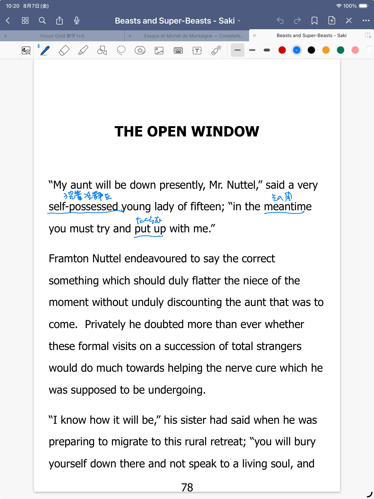

## 今日読んだところ

**読書範囲：** 表示確認用

### 今日読む原文

今日読む原文を開く

This is a test passage for The Open Window.

The full English text will appear here when the reading begins.

### 日本語で読む

これは、Saki「開いた窓」の読書記事が正しく表示されるかを確認するためのテストです。

---

## 英文を考える

### 今日のこの一節

> This is a test passage for The Open Window.

### 最初に読んだときの訳

これは『開いた窓』のためのテスト文です。

### 読み直した訳

これは、Saki「開いた窓」の記事表示を確認するためのテスト文です。

### 文の骨格

- 主語：This
- 動詞：is
- 補語：a test passage

### 今回つまずいたところ

今回は表示確認用のため、英語の解説はありません。

---

## 今日の単語・言い回し

- **test passage**  
  表示確認用の文章。

---

## 感じたこと

### 英語について

今回は記事の表示確認です。

### 文学として

本編は次回から始めます。
